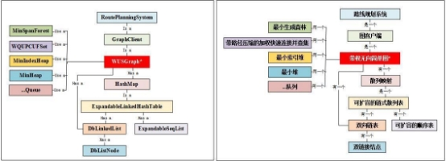

2023 秋计算机学院“数据结构课程设计”题目及要求

【课程设计任务】

“数据结构课程设计”是一门必修的实践课程，要求每个学生必须在规定时间里到实验 室机房上机完成。

“数据结构课程设计”题目共分两组，每个同学可任选一组完成。注意题目的备注，团 队合作的题目如果是 2 个人合作完成，每个人需要明确各自的具体分工，且分别提交此题报 告列出合作题目两个人的具体分工，并详细介绍自己实现哪些功能、以及如何实现。

第一次上机前每位同学需完成选题，然后按工程化的基本流程分别完成如下任务：1） 阅读题目要求，熟悉问题；2）对设计问题进行需求分析；3）系统设计，明确程序的模块结 构；设计数据结构（逻辑结构及其物理结构），设计主要子问题的求解算法；4）程序实现； 5）程序测试；6）程序优化；7）设计总结，撰写课程设计报告。

成果提交：将程序源代码/工程文件、可独立运行的可执行程序、简要操作手册及“数 据结构课程设计”实习报告电子版（模板 http://pan.baidu.com/s/1o8lHP6E）打包，文件 命名格式为“专业班级-学号-姓名”，如：19C221-学号-\*\*\*。并将设计报告打印为纸质版（A4 双面打印），然后以班为单位在指定时间将电子版和纸质版集体提交到指导老师。

【课程设计总体要求】

1 坚守学术诚信

鼓励有个人特色的创新，可酌情予以加分。严禁对程序与报告的抄袭行为（包括来自网 络资源及其他同学的代码和文档），后续会对代码和报告进行查重，一经发现抄袭，课程设 计成绩计 0 分，以考试抄袭舞弊行为处理。

2 程序规范

程序遵从一般性规范：

⑴  源码依据模块组织到不同.h 与.cpp 文件中，不要将全部程序放到一个源文件中。

⑵  变量和函数名称尽量基于描述性命名，遵循见名知义的原则。

⑶  函数头有统一注释，说明功能，输入输出与条件等。

⑷  函数内部关键处理步骤处加上注释予以说明。

3 报告规范，内容完善

按照格式规范与内容要求撰写课程设计报告，报告主要内容应至少涵盖如下方面：（请 参考数据结构课程设计模板 http://pan.baidu.com/s/1o8lHP6E，且仅粘贴关键代码并附上 注释，不要把所有代码都贴到实习报告里，纸质报告请双面打印，一份报告包含全部题目） 一、问题描述

二、需求分析

三、程序总体设计(含模块结构图)

四、数据结构和算法详细设计

五、程序实现  (C++语言程序实现的简要说明，如开发环境、支持包、函数原型与功能及调 用关系；全部源程序以电子版提供，报告中只能作为附录内容之一) 六、程序测试及结果分析

七、复杂度分析

八、总结、特色与不足

主要参考文献

4 检查与验收

课程设计最终成绩由平时成绩、演示程序并回答问题、课程设计报告三个部分综合 评定。如果未经老师验收程序并回答提问、或者不交实习报告都将作为“不及格”处理。

在设计课内，全体同学需给指导老师演示程序，讲解程序，回答老师提问，验收或 报告完成情况。结课后提交课程设计报告。

【课程设计题目】

本次课程设计题目分为两组，每人任选一组完成。 未经许可不要轻易更换组号和题目。 第一组：海关检查站模拟，计算动态中位数，交通咨询系统设计，简单搜索引擎系统 第二组：高效带权无向简单图与交通路线规划系统（团队完成）

题目 **1**：离散事件模拟——海关检查站模拟（个人完成，**35** 分）\*\*

【问题描述】 考虑一个负责检查过境车辆的海关检查站，开发一个具体的模拟系统。对于这个系统，假设 有如下的基本考虑：

1、海关的职责是检查过往车辆，这里只模拟一个通行方向的检查。

2、假定车辆按一定速率到达，有一定随机性，每 a 到 b 分钟有一辆车到达。 3、海关有 k 条检查通道，检查一辆车耗时 c 到 d 分钟。

4、到达的车辆在一条专用线路上排队等待，一旦有一个检查通道空闲，正在排队的第一辆 车就进入该通道检查。如果车辆到达时有空闲通道而且当时没有等待车辆，它就立即进入通 道开始检查。

5、希望得到的数据包括车辆的平均等待时间和通过检查站的平均时间。

【基本要求】

1、仿真事件（如车辆到达，检查时间，车辆离开等）可根据某种概率分布或随机模型生成。 2、要求该系统对海关检查站的检查过程进行模拟，并且输出一系列事件，及车辆的平均排 队时间和平均通过时间。

3、测试数据要求有一定规模，对实测结果要进行统计分析。

【扩展要求】

1、 请修改海关检查站模拟系统，改用每个检查通道一个等待队列的管理策略。对这种新策

略做一些模拟，并将模拟结果与共用等待队列的策略比较。

2、 设计可视化图形界面展示模拟过程。

题目 **2**：计算动态中位数（个人完成，**15** 分）\*\*

【问题描述】

- 给定一系列数据，如果按大小排序，则中位数只是中间项（数据个数为奇数），或者 如果没有中间项（数据个数为偶数），则为两个中间项的平均值。  例如，序列  3, 1, 9, 25, 12  的中位数是  9  ，而序列  8, 4, 11, 18 的中位数是  9.5。
- 如果增加数据，则需要能够动态维护运行中位数。即当遇到每个新数据时，都会计 算更新的中位数。  当然，这应该尽可能高效地完成。
- 例如，依次读入数据 3, 1, 9, 25, 12，则动态返回的中位数列表应该是 3, 2.0, 3, 6.0, 9。

【基本要求】

1. 首先设计一个计算动态中位数的初始算法版本，可以每次读入新数据时，及时排序

并更新当前中位数；

1. 设计计算动态中位数的高效优化算法版本，可借助于堆（heap）实现，并分析算法的

时间复杂度；

1. 对于高效优化版本，测试数据规模为对 10 万个随机数据计算中位数，统计运行时间

（单位：秒）。

题目 **3**：交通咨询系统设计（个人完成，**40** 分）\*\*

【设计目的】

熟练掌握迪杰斯特拉算法和费洛伊德算法，能够利用它们解决最短路径问题。 掌握图的深度，广度遍历算法。

掌握快速排序算法。

【基本要求】

设计一个交通咨询系统，通过读取全国城市距离图（http://pan.baidu.com/s/1jIauHSE，请在程 序运行时动态加载到内存，可将 excel 转成 csv 方便读取），实现：

1、请验证全国其他省会城市（不包括港澳和两个宝岛台北和海口）到武汉中间不超过 2 个 省（省会城市）是否成立？（正是因为武汉处于全国的中心位置，此次疫情才传播的如此广） ； 2、允许用户查询从任一个城市到另一个城市之间的最短路径（两种算法均要实现，界面上 可自行选择）以及所有不重复的可行路径（可限制最多经过 10 个节点），并利用快速排序对 所有路径方案依据总长度进行排序输出（输出到文件），每一条结果均需包含路径信息及总 长度，试比较排序后的结果与迪杰斯特拉算法和费洛伊德算法输出的结果；

3、假设在求解 2 个城市间最短路径时需要绕过某个特定的城市（用户输入或者选择，例如 武汉），请问应该如何实现？

4、不基于功能 2 遍历的结果如何直接求解两个城市间的前第 K 短的路径，例如，武汉到北 京之间第 3 短的路径。

题目 **4**：简单搜索引擎系统（团队完成，**10** 分）（自行组队，每队不超过 2 人，需有

明确分工，实习报告中需明确注明每人的分工） 【设计目的】

掌握倒排索引相关算法。

掌握字符串的相关处理方法。

掌握文件的操作。

学习使用开源代码库。

学习团队分工合作以及 svn/git 代码版本控制软件。

【基本要求】

给定 n 个文本文件（检查时我会提供测试数据，编程时请自行收集，需实现导入某一个文件 夹下所有文本文件的功能。同时也鼓励大家直接从网页上抓取数据(例如从微博网抓取网页 到本地，该功能即为网页爬虫，可利用任何开源代码，建议使用 Python，处理网络数据很方 便，请自行网上查找，不要求看懂内部实现，会用即可，如实现该功能有加分，参考 https://github.com/dataabc/weiboSpider，https://github.com/liinnux/awesome-crawler-cn 等），具 体需求如下:

1、依次读取 n 个文本文件（或者自行爬取的网页数据）并利用分词函数建立倒排索引（详 查 看 字 符 串 章 节 ppt ， 请 利 用 开 源 代 码 https://github.com/yanyiwu/cppjieba  或 者 http://www.oschina.net/p/freeictclas，亦可自行网上查找其他解决方案，不需要自行实现和看 懂内部实现，只需要会用）；

2、自行设计查找算法，支持从倒排索引中检索给定的字符串，请提供用户输入查找字符串 的页面，相当于百度首页的输入框（不要直接使用 Hashtable，对于海量数据，直接使用哈希 表是不够的）；

3、自行设计排序算法，即需要考虑当查询字符串出现在多个文档中时，哪个文档在输出后 的结果中排第一 or 第二 or...，可参考 pagerank 算法（基于超链接的网页权重计算方法，可 查找相关开源代码并调用）以及常见文本相似度计算方法（基于文本相似度的文档权重计算 方法，https://zhuanlan.zhihu.com/p/88938220），也可自行设计任何可用、有一定意义的算法， 简单/复杂均可；

4、自行设计搜索结果展示界面，要求能将关键字出现的位置附近的上下文显示出来，请参 考百度的搜索结果展示页面，注意，不能在检索后对所有检索结果用字符串模式匹配函数进 行关键字查找（即不要进行事后匹配，因为返回的结果是海量的）！

5、思考一下，如果数据量继续增大应该如何进行算法优化？

测试数据：ht[tp://www.nlpir.org/wordpress/download/tc-corpus-answer.rar](http://www.nlpir.org/wordpress/download/tc-corpus-answer.rar)

题目 **5**：高效带权无向简单图与交通路线规划系统（团队完成，自行组队，每队不超

过 2 人，需有明确分工，实习报告中需明确注明每人的分工）

介绍\*\*

图是用边成对连接的一组顶点。图是广泛、有用、强大的数学抽象，可以描述从生物学 和高能物理学到社会科学和经济学等领域的复杂关系和相互作用系统。目前已知数百种图算 法，数以千计的实际应用，是计算机科学和离散数学引人入胜的一个分支。元素之间的成对 连接在大量计算应用程序中起着至关重要的作用。例如在人工智能和大数据领域，知识图谱 使用图数据库，深度学习使用图神经网络。

为了使用图解决实际应用问题，我们需要：

1. 用于表示图的底层数据结构。底层数据结构的选择会对运行时间、内存使用情况、实

现各种图算法的难度等方面产生深远的影响。

1. 图的应用程序编程接口（**Application Programming Interface, API**）。这些 **API** 是我

们提供给图客户端（**Client**）程序开发人员可用的方法列表，包括方法签名（每个函数接受 的参数）及其行为。客户（希望使用我们的图数据结构的人）可以使用我们提供的任何函数 来实现他们自己的算法而无需访问源码或理解内部工作机制的[细节。**API**  定义](https://baike.baidu.com/item/%E5%B7%A5%E4%BD%9C%E6%9C%BA%E5%88%B6/9905789)客户端程序 开发人员必须如何思考。我们提供的方法会对客户实施特定算法的难易程度产生重大影响。

我们的图 **API** 约定，将图的每个顶点与一个整数一一对应。可以通过维护一个映射来 告诉我们为每个原始顶点标签分配的整数。如图 **1** 所示。这样做允许我们定义自己的图 **API** 来专门处理整数结点，而不是引入泛型类型，从而简化底层内部数据结构，同时支持各种外 部应用。

*图 1  图 G 的整数顶点图 G’以及顶点标签-整数映射*

本课题 在软件工程的基本指导原则下 探索 和练习 一种高效的 带权无向简单 图

- **Weighted Undirected Simple Graph, WUSGraph**，**WUSGraph**）数据结构及其 API 以及 开发它的客户端应用程序系统，分为三部分。第一部分是实现一种高效的带权无向简单图的 底层数据结构 **WUSGraph** 以及 **WUSGraph API**，第二部分是测试和应用 **WUSGraph API** 开发客户端程序 **WUSGraphClient** 以及 **WUSGraphClient API**。第三部分是测试和应用 **WUSGraphClient   API** 开发图的应用系统 **WUSGraph Application**。 在这个课题，你将深入体会双向链表的优势、散列表技术的高效、 **C++  STL unordered_map** 的实现原理、“伙伴”指针的优势、父指针表示法的强大描述能力、映射与 无向图的应用；体会到底层数据结构的选择如何影响系统渐进运行时间和代码复杂性；体会 到软件工程技术对系统软件开发的支持；体会到抽象与分离原则带来的好处；体会到面向对 象编程中封装、继承、多态、重载、抽象、访问权限等技术提高编程效率的优势。 带权无向简单图项目的初始类图见图 **2**。在后面将自底向上具体论述每个类。

*图 2 WUSGraph 项目的初始类图参考*

第一部分\*\* 高效的带权无向简单图应用程序接口

*模板说明：*

**E** 是数据元素模板。**K** 是数据元素的关键字模板。在映射中，**V** 是关键字值对应的值的模 板。

*类的说明：*

**1**、成员变量：请自行设计每个类的成员变量。成员变量使用 **private** 或 **protected**  可见性。 **2**、方法说明：使用合适的 **private**、**protected**、**public** 可见性。对使用类的用户只开放必要 的接口，对敏感数据或不需要用户知道的数据和方法则隐藏在类的内部，外部用户不可见， 以把类的创建者和类的使用者之间隔离开。

**3**、封装要求：图的内部数据结构不接触外部应用。

4、请自行设计每个类的构造函数、析构函数。为节省篇幅，文内省略构造函数、析构函数

的论述。

**5**、如果需要，请自行增加有效的辅助方法。

**6**、如果需要，请自行设计需要的迭代器类和类的迭代器方法 **iterator Begin()**、**iterator End()**。 **7**、本项目不使用 **C++ STL** 的容器（**set** 除外）。

评分说明：

系统功能的正确性以及数据结构设计与实现的高效性是本项目评分的重要依据。 *合作说明：*

1、建议自底向上每层数据结构和 **API** 开发任务工作量、难度平均分配。合作双方动手开发 前提交分工文档，详细罗列每人负责的编制和测试模块任务。

2、虽然界面是系统功能的一部分，但是界面设计不是本课题的主要内容，因此约定文本界 面设计的工作量相当于 **2** 个模块的工作量，图形界面设计的工作量相当于 **4** 个模块的工作 量。

任务1.1.\*\* 双链结点 **DbListNode**

任务1.2.\*\* 实现双向链表 **DbLinkedList**

根据课题需要，自行设计表 1 方法合适的参数、返回值。|V|代表链表中当前元素数 目。性能要求：凡扫描链表操作要在一趟扫描结束时完成。空间要求：不使用额外的辅助 数组。

*表  1  双向链表 API以及性能要求*

| 序号 | 函数 | 函数功能 | 时间复杂度要求 | 完成情况 |
|----|----|------|---------|------|
| 1 | Search() | 查找 | O(1ž | V |
| 2 | Insert() | 插入 | O(1ž | V |
| 3 | Remove() | 删除 | O(1ž | V |
| 4 | Clear() | 移除所有元素（已销毁）， 并保留大小为 0 的链表。 | O(1ž | V |
| 任务1.3.\*\* 实现可扩容的数组列表 **ExpandableArrayList** |  |  |  |  |

方法的性能说明与要求同任务 1.2。注意，数组列表不是顺序表，操作无需移动元素。

*表  2  可扩容数组列表 API以及性能要求*

| 序号 | 函数 | 函数功能 | 时间复杂度要求 | 完成情况 |
|----|----|------|---------|------|
| 1 | **E&[ operator\[\](in](http://www.cplusplus.com/reference/array/array/operator%5b%5d/)t i)** | 
例如：ExpandableArrayList<int> A(10); for (int i=0; i<10; i++) A[i]=i; 

for (int i=0; i<10; i++)  

std::cout<<' '<<A[i]; 
 | O(1) |  |
| 2 | **void resizeList**() | 扩大数组容量。用当前容量的两倍设置 新容量。调整大小时，请确保乘法增加 大小，而不是加法（例如乘以 2，不要 | O(1ž | V |

|  |  | 加 100 或其他）。您不需要缩小容量。 |  |  |
|:-|:-|----------------------|:-|:-|
| 3 | void Clear() | 移除所有元素（已销毁），并保留大小 为 0 的数组。 | O(1) |  |
| 任务1.4.\*\* 实现可扩容的链式散列表 **ExpandableLinkedHashTable** |  |  |  |  |

请自行设计合适的哈希函数、链地址法冲突解决策略、素数查找表等散列表各技术要 素 。 链 表 使 用 任 务 **1\.2** 中 的 双 向 链 表 **DbLinkedList** 。 桶 数 组 使 用 任 务 **1\.3** 的 **ExpandableArrayList**。

*表  3  可扩容的链式冲突解决策略的散列表 API以及性能要求*

| 序号 | 函数 | 函数功能 | 时间复杂度要求 |  | 完成情况 |
|----|----|------|---------|:-|------|
| 1 | ExpandableLinkedHashTable() | 初始化初始化空散列表。最初有 |  |  |  |
| 2 | ExpandableLinkedHashTable(int initialSize) | initialSize 个桶。如果没有给出 initialSize 和 maxLoadFactor，设置 | O(1) |  |  |
| 3 | ExpandableLinkedHashTable(int initialSize, double maxLoadFactor) | 默认值 initialSize = 16 和 maxLoadFactor= 0.7。 |  |  |  |
| 4 | ~ExpandableLinkedHashTable() | 销毁所有元素，并释放分配的所有存储 容量。 | O( | V | ) |
|  |  | 获取散列表中指定键 key 映射到的双向 |  |  |  |
| 5 | **DbListNode** \* findPos(const K& key, int &bucket) const | 
链表结点，通过 bucket 返回桶号。如果 散列表不包含具有键的元素，返回值

0，
 | O(1) |  |  |
|  |  | bucket 为-1。 |  |  |  |
| 6 | bool Search(const K&) const | 在散列表中查找。 | O(1) |  |  |
|  |  | 将元素 e 插入到散列表中。为防止重复 |  |  |  |
| 7 | bool Insert(const E&e) | 键，更新元素的正确过程是首先删除元 | O(1) |  |  |
|  |  | 素，然后使用新值重新插入。 |  |  |  |
| 8 | int Remove(const K&, E& e) | 将给定值从散列表中删除，通过参数 e 返回，函数返回删除数据元素的个数。 | O(1) |  |  |
|  |  | 散列表会自动增加桶的数量以保持负载 |  |  |  |
|  |  | 因子低于  maxLoadFactor。用当前容量 |  |  |  |
| 9 | void **resizeTable**() | 的两倍最近的素数设置新容量。调整大 小时，请确保乘法增加大小，而不是加法 | O( | V | ) |
|  |  | （例如乘以  2，不要加  100  或其他）。 |  |  |  |
|  |  | 您不需要缩小容量。 |  |  |  |
| 10 | void Clear() | 移除所有元素（已销毁），并保留大小 为 0 的散列表。 | O( | V | ) |
| 11 | int getCapcity() const | 返回散列表容量。 | O(1) |  |  |
| 12 | int getSize() const | 返回桶数。 | O(1) |  |  |
| 13 | int **getBucket**(const K& k) const | 返回 k 对应的桶序号。 | O(1) |  |  |
| 14 | int getBucketSize(int i)const | 返回第 i 个桶的元素数。 | O(1) |  |  |
| 任务1.5.\*\* 散列映射 **HashMap** |  |  |  |  |  |

键是关键字的简称。在键值对(key，value)中，值 value 是与键 key 一对一的键值（或 值），其中 key 是 K 类型，value 是 V 类型。

映射 Map 是(key，value)键值对的集合。映射 Map 的数据元素是键值对(key，value)。 键 key 用作元素在  Map  中的索引：Map 只通过键值查找元素。每个键 key 只能在 Map 中 出现一次。

使用任务 1.4  的可扩容的链式冲突解决策略的散列表 ExpandableLinkedHashTable 实现 散列映射 HashMap。可以使用 C++  STL 中提供的键值对类 std::pair<K,V>和集合类 std::set<K>。|V|代表映射中键值对的数目。

可参考：

1、LeetCode 706：不使用任何内建的哈希表设计一个哈希映射。

2、C++ STL  容器 unordered_map:

[http://www.cplusplus.com/reference/unordered_map/。 ](http://www.cplusplus.com/reference/unordered_map/%C3%A3%C2%80%C2%82)

*表  4  散列映射 API以及性能要求*

<table><tr><th colspan="1">序号</th><th colspan="1">函数 </th><th colspan="1">函数功能 </th><th colspan="1">时间复杂度要求</th><th colspan="1"></th><th colspan="1">完成情况 </th></tr>
<tr><td colspan="1">1 </td><td colspan="1">HashMap() </td><td colspan="1" valign="bottom">初始化初始化空映射。最初有 initialSize 个桶。如果没有给出</td><td colspan="1"></td><td colspan="1"></td><td colspan="1"></td></tr>
<tr><td colspan="1">2 </td><td colspan="1">HashMap(int initialSize) </td><td colspan="1" rowspan="2" valign="top">initialSize  和 MaxLoadFactor，设置默 认值 initialSize = 16  和 MaxLoadFactor= 0.7。 </td><td colspan="1" rowspan="2" valign="top">O(1) </td><td colspan="1" rowspan="2"></td><td colspan="1"></td></tr>
<tr><td colspan="1">3 </td><td colspan="1">HashMap(int initialSize, double MaxLoadFactor) </td><td colspan="1"></td></tr>
<tr><td colspan="1">4 </td><td colspan="1">V& getValue(const <b>K& key</b>) </td><td colspan="1">获取 Map 中指定键 key 映射到的值， 如果 Map 不包含键的映射，返回 V()。</td><td colspan="1">O(1) </td><td colspan="1"></td><td colspan="1"></td></tr>
<tr><td colspan="1">5 </td><td colspan="1">std::set<K> keySet() </td><td colspan="1">返回 Map 中包含的键的集合。</td><td colspan="1">O(1) </td><td colspan="1"></td><td colspan="1"></td></tr>
<tr><td colspan="1">6 </td><td colspan="1">bool containsKey(const K& key) </td><td colspan="1">如果 Map 包含指定键 key 的映射，则 返回 true </td><td colspan="1">O|V| </td><td colspan="1"></td><td colspan="1"></td></tr>
<tr><td colspan="1"></td><td colspan="1"></td><td colspan="1">在 Map 中添加键值对 <b>k_v</b>。在 Map 中</td><td colspan="1"></td><td colspan="1"></td><td colspan="1"></td></tr>
<tr><td colspan="1">7 </td><td colspan="1">void Insert( <b>std::pair</b><K,V> k_v); </td><td colspan="1">将指定值 value 与指定键 key 相关联。 如果键 k_v.key 已经存在，那么原来的</td><td colspan="1">O(1) </td><td colspan="1"></td><td colspan="1"></td></tr>
<tr><td colspan="1"></td><td colspan="1"></td><td colspan="1">键值对将被替代成新的键值对。</td><td colspan="1"></td><td colspan="1"></td><td colspan="1"></td></tr>
<tr><td colspan="1">8 </td><td colspan="1">V& Remove(const K& key); </td><td colspan="1">从 Map 中删除指定键 key 的映射（如 果存在）。</td><td colspan="1">O(1) </td><td colspan="1"></td><td colspan="1"></td></tr>
<tr><td colspan="1">9 </td><td colspan="1">V& Remove(const K& key,const V& val); </td><td colspan="1">`  `仅当键 key 当前映射到指定值 value 时，才删除该项映射。</td><td colspan="1">O(1) </td><td colspan="1"></td><td colspan="1"></td></tr>
<tr><td colspan="1">10 </td><td colspan="1">void Clear(); </td><td colspan="1">移除所有键值对（已销毁），并保留大 小为  0  的映射。 </td><td colspan="1">O(|V|) </td><td colspan="1"></td><td colspan="1"></td></tr>
<tr><td colspan="1">11 </td><td colspan="1">int getSize(); </td><td colspan="1">返回 Map 中的键-值对映射的总数</td><td colspan="1">O(|V|) </td><td colspan="1"></td><td colspan="1"></td></tr>
<tr><td colspan="1">12 </td><td colspan="1">~HashMap() </td><td colspan="1">销毁所有元素，并释放分配的所有存 储容量。 </td><td colspan="1">O(|V|) </td><td colspan="1"></td><td colspan="1"></td></tr>
<tr><td colspan="1"></td><td colspan="1"></td><td colspan="1">散列表会自动增加桶的数量以保持负</td><td colspan="1"></td><td colspan="1"></td><td colspan="1"></td></tr>
<tr><td colspan="1">13 </td><td colspan="1">void <b>resizeTable</b>() </td><td colspan="1">载因子低于  maxLoadFactor。用当前</td><td colspan="1">O(|V|) </td><td colspan="1"></td><td colspan="1"></td></tr>
<tr><td colspan="1"></td><td colspan="1"></td><td colspan="1">容量的两倍最近的素数设置新容量。</td><td colspan="1"></td><td colspan="1"></td><td colspan="1"></td></tr>
</table>

|  |  | 调整大小时，请确保乘法增加大小，而 不是加法（例如乘以 2，不要加 100 或其他）。您不需要缩小容量。 |  |  |
|:-|:-|------------------------------------------------------|:-|:-|
| 任务1.6. \*\*\*\*\*高效的带权无向简单图 |  |  |  |  |

为了提高速度，带权无向简单图 G=(V, E, W)使用三个数据结构来实现：双向链表 **DbLinkedList**、图邻接表和散列映射 HashMap。请按照下表要求的时间复杂度来实现图的具 体操作，其中|V|表示图 G 的顶点数，|E|表示图 G 的边数，d 是顶点的度数，假设|E|>|V|。使 用模板以支持图的顶点数据类型 Object 和边的权值类型 Weight 可以是任意类型（假设它们 是可比较的）。Neighbors类中包含顶点的邻接顶点数组 Object object\[\]和对应权值数组 Weight weight\[\]。

图的内部结构约定：如图 3 所示，每个顶点与一个整数一一对应，即顶点处理为整数顶 点，被编号的顶点与“标签”无关，并在整个图内部结构顶点是整数，边是整数顶点偶对， 与顶点“标签”无关。要通过字符串标签查找顶点，你需要使用 HashMap<string, int>。

*表  5  高效的带权无向简单图 API以及性能要求*

| 序号 | 函数 | 函数功能 | 时间复杂度要求 |  | 完成情况 |
|----|----|------|---------|:-|------|
| 1 | WUSGraph(int v) | 用 v 个顶点和  0  条边初 | O( | V | ) |
|  |  | 始化一个空图 |  |  |  |
| 2 | int vertexCount() | 返回图中的顶点数 | O(1) |  |  |
| 3 | int edgeCount() | 返回图中的边数 | O(1) |  |  |
| 4 | Object\* getVertices() | 返回包含所有顶点的数组 | O( | V | ) |
| 5 | void addVertex(Object) | 添加顶点 | O(1) |  |  |
| 6 | void removeVertex(Object) | 删除顶点 | O(d)\* |  |  |
| 7 | bool isVertex(Object) | 判断该顶点是否在图中 | O(1)\* |  |  |
| 8 | int Degree(Object) | 顶点的度 | O(1) |  |  |
| 9 | Neighbors getNeighbors(Object) | 返回顶点的所有邻接顶点 | O(d)\* |  |  |
| 10 | void addEdge(Object,Object,Weight) | 添加边 | O(1) |  |  |
| 11 | void removeEdge(Object,Object) | 删除边 | O(1)\* |  |  |
| 12 | bool isEdge(Object,Object) | 判断是否为边 | **O(1)**\* |  |  |
| 13 | Weight getWeight(Object,Object) | 求某边的权值 | O(1) |  |  |
| \*标注操作的性能得到显著提升。 |  |  |  |  |  |

*图 3 \*带权无向图 WUSGraph 数据结构参考解决方案*

参考解决方案：为达到表 5 方法高效目的，采取以下思想来实现特定操作（参考图 3）：

- 1）首先需要设计顶点的内部数据结构，例如顶点线性表。为使 removeVertex()时间复

杂度为 O(d)，则顶点线性表的内部数据结构应该是顶点结点的双向链表，不能是数组，也不 能是单链表。使用任务 1.2 的双向链表 DbLinkedList。

- 2）需要使用一种将外部应用程序提供的每个顶点映射到顶点内部数据结构的方法。最

好的方法是使用散列映射。散列映射可以支持 isVertex()的时间复杂度为 O(1)。使用任务 1.5 的散列映射 HashMap。

- 3）为使得 getNeighbors()时间复杂度为 O(d)，需要维护每个顶点的邻接边的线性表；

为使 removeEdge()时间复杂度是 O(1)，则顶点的邻接边线性表应该是边结点的双向链表， 不能是数组，也不能是单链表。使用任务 1.2 的双向链表 DbLinkedList。为使 removeVertex()时间复杂度为 O(d)，需要有从边到顶点的指针。

- 4）在无向图中，边（u，v）必须出现在两个链表中（u 顶点和 v 顶点的邻接边链表）。

若要删除顶点 u，则必须删除 u 顶点的邻居顶点的邻接边链表中所有与 u 相关联的边。为使 removeVertex()时间复杂度为 O(d)，不能遍历所有邻居顶点的这些邻接边链表，可以尝试用 下列方法来得到 O(d）的时间效率：既然边（u，v）在图中出现在两个链表中，则可以用两 个结点来表示（u，v），设分别在 u 表和 v 表中。这些结点每一个可称为\*\*“**半边**”**，其中一条 边为另一条的**“**伙伴**”\*\*。每一个半边有向前和向后的指针链入邻接边链表中，此外该半边和其 伙伴由“伙伴指针”相关联。采用这种方式，我们可以从图中删除 u 时，在遍历 u 的邻接边 链表时，使用伙伴指针来删除每条半边的在 u 的邻居的邻接边链表中的伙伴边，且只使用 O(1)的时间！

- 5）为使 removeEdge()、isEdge()、getWeight()时间复杂度为 O(1)，需要第二个散列映射

来将外部应用程序提供的每个顶点的无序偶对映射到边内部数据结构。使用任务 1.5 的散列 映射 HashMap。为使 removeVertex()时间复杂度为 O(d)，在从顶点的邻接边链表上删除边的 同时，也需要从边散列映射表中删除边，且从顶点散列映射表中删除顶点。

- 6）为使 vertexCount()、edgeCount()、Degree()时间复杂度为 O(1)，需要在内部数据结

构添加边、顶点的计数器以及每个顶点的度数，并且在每个操作注意其动态更新。

第2部分\*\* 测试和应用带权无向图 **API** 开发带权无向图客户 端及 **API**

高效带权无向图客户端 WUSGraphClient 类继承高效带权无向简单图 WUSGraph 类，有 插入顶点、插入边等公共方法，此外，具有表 6 中方法。第二部分实现的类、方法要满足下 面封装要求：（表 6、7、8 中的方法）图的外部应用不接触内部数据结构，只可通过 WUSGraph API 访问图内部数据结构。

第二部分使用 Object、Weight 模板分别表示支持顶点、边权值可以是任何类型（假设它 们可比较）。Graph 代表 WUSGraph 类型。Path、Tree、Forest 分别代表路径、树、森林类型。 Path、Tree、Forest 采用父指针表示法。由于要满足封装要求，Path、Tree、Forest 不能接触 图内部数据结构，可以再次使用 HashMap，将外部应用顶点映射到唯一外部应用整数编号， 再利用数组的按下标索引和映射的按关键字索引实现。

自行设计表 6 中 DFS()和 BFS()函数形参的参数、Steiner()和 LongestPath()的函数参数， 完成 Steiner()、LongestPath()方法后分析算法时空性能填入表 6。Eula()是选做内容。

*表  6  带权无向图客户端 API以及性能（时间、空间）要求*

| 序号 | 函数 | 函数功能 | 时间复杂度要求 | 空间复杂度要求 |  | 完成情况 |
|----|----|------|---------|---------|:-|------|
| 1 | void CreateGraphFromFile(string filepath, Graph& g) | 从给定文件路径 filepath 读取文件，构造图 g。 | O( | V | \+ | E |
| 2 | int MaxDegree(const Graph&) | 返回 g 顶点的最大度数。 | O( | V | ) | O(1) |
| 3 | void Print(const Graph& g) | 输出 g 顶点集和边集。 | O( | V | \+ | E |
| 4 | void DFS(Graph& g, void (\*visit) (... ...)) | 深度优先遍历 g，访问函数 是(\*visit)()。 | O( | V | \+ | E |
| 5 | void BFS(Graph& g, , void (\*visit) (... ...)) | 广度优先遍历 g，访问函数 是(\*visit)()。 | O( | V | \+ | E |
| 6 | void Kruskal(const Grah& g, Forest& msf) | 优化的 Kruskal 方法求解 g 最小生成森林 msf。 | 排序时 O( | E | log | E |
| 7 | void Dijkstra(const Graph&g,Object &s,Tree& spt) | 优化的 Dijkstra 方法求解 g 源点 s 的最短路径树 spt。 | O( | E | log | V |
| 8 | void Prim(const Grah&g, Forest& msf) | 优化的 Prim 方法求解 g 最 小生成森林 msf。 | O( | V | log | V |
| 9 | void LongestPath(const Graph& g,Object &s, Tree& lpt) | 求 g 源点 s 到其它各顶点的 最长路径树 lpt。 | O(?) | O(?) |  |  |
| 10 | Steiner(const Graph&g, Object \*& objectlist, Forest& msf) | 给定 g的顶点子集 objectset， 求解对应的斯坦纳森林。 | O(?) | O(?) |  |  |
| 11 | （选做 1）Eula() | 判断存在则求解 g 欧拉图。 | O( | E | ) | O( |
| 任务2.1. **CreateGraphFromFile()** |  |  |  |  |  |  |

从文件以块读取方式读入顶点和边数据，通过调用 WUSGraph API 将顶点和边信息存 入到高效带权无向图对象的内、外部数据结构。

从外存读取文件到内存时，以块（block）为单位，借助磁盘缓冲区实现内外存数据交 换。根据计算机原理可知，从磁盘读写 1B 与读写 1KB  几乎一样快。为高效读取文件，每 一次读取应该尽可能读取更多的数据。因此采用块读取，而不是一个字符一个字符、一个 字符串一个字符串、一行文本一行文本地读取。

任务2.2. \*\*MaxDegree()\*\*返回图顶点的最大度数

任务2.3.\*\* 使用递归和队列实现图的遍历

任务2.3.1.\*\*  选择并实现一种合适本课题的队列

任务2.3.2.\*\*  深度优先遍历算法 **DFS()**

任务2.3.3.\*\*  广度优先遍历算法 **BFS()**

任务2.4.\*\* 基于数据结构尽可能高效实现 \*\*Kruskal()**求最小生成森林 任务2.4.1.**  实现最小堆类 **MinHeap**

堆是用于优先级功能的非常重要的数据结构。它在优先级排序方面的表现有助于我们有 效地实现基于找到最小值、最大值的算法。

任务2.4.2.\*\*  实现最小生成森林类 **MinSpanForest**

最小生成森林采用父指针表示法。最小生成森林数据结构采用图的外部应用整数顶点编 号，外部应用顶点可以使用 HashMap 将图顶点对象的外部应用整数映射到外部标签。自行 设计 InsertEdge()函数参数、返回值类型。

*表  7  最小生成森林类 API以及性能要求*

| 序号 | 函数 | 函数功能 | 时间复杂度要求 | 空间复杂度要求 | 完成情况 |
|----|----|------|---------|---------|------|
| 1 | InsertEdge() | 插入一条边到最小生成森林 | O(1) | O(1) |  |
| 任务2.4.3.\*\*  带路径压缩的加权快速连接并查集类 **WQUPCUFSet** |  |  |  |  |  |

带路径压缩的加权快速连接并查集（Weighted Quick Union with Path Compression UFSets， **WQUPCUFSet**）并、查操作的性能要求 O(α(|V|))，非常接近常数时间。|V|是元素个数。

任务2.4.4.  \*\*Kruskal()**求最小生成森林**

使用任务 2.4.1-2.4.3 中的 MinHeap、WQUPCUFSet、MinSpanForest 实现 Kruskal()算法 求出最小生成森林。你的实现应该在 O(|E|log|E|)时间中运行：排序时 O(|E|log|E|)、排序后 O(|E|α(|V|))，其中|V|是 G 的顶点数，|E|是 G 的边数。

在列出 G 中所有的边时，你不能通过对每对顶点调用 isEdge()来构建此列表，因为这 样做需要 O(|V|2)时间。你需要使用多次调用 getNeighbors()来获取完整的边列表。封装要 求：图类的内部数据结构不接触应用（包括 **Kruskal**、**Prim**、**Dijkstra** 等所有图算法）。

使用改进的并查集求最小生成树的边时，需要一种方法将顶点标签映射为唯一的整数 或者顶点结点。如果两个不是它们各自的集合的根的顶点合并，或者如果顶点与其自身合 并，会导致灾难性失败。如果你添加简单的错误检查，可能会为您节省大量调试时间。

任务2.5.\*\* 基于数据结构尽可能高效实现 \*\*Dijkstra()\*\*得到最短路径树 任务2.5.1.  \*\*\*\*\*实现最小索引堆 **MinIndexHeap**

在堆中发生交换时直接交换数组中两个元素，数组元素位置发生改变会导致元素与位置 关联信息丢失，以至于很难找到元素做修改。为此，使用两个数组，一个是存放数据的数组 （数据不移动），一个是存放各个元素当前的位置信息的索引数组。当堆调整发生交换时， 交换的是索引数组对应两个元素的位置，而不是交换数据数组的两个元素。这主要有两个好 处：1.减小交换操作的消耗，尤其是对于元素交换需要很多资源的对象来说，比如大字符串。 2.数据数组的元素不发生移动，可以在原位置找到元素，即便这个元素的索引已经修改。

E 表示堆中数据元素的模板。|V|表示堆中当前元素的数目。

*表  8  最小索引堆 API以及性能要求*

| 序号 | 函数 | 函数功能 | 时间复杂度要求 | 完成情况 |
|----|----|------|---------|------|
| 1 | MinIndexHeap(E arr\[\], int n) | 大小为 n 的数组最小堆化 | O( | V |
| 2 | bool Insert(const E &x) | 数组插入 x 后最小堆化 | O(log | V |
| 3 | bool removeMin(E &x) | 数组删除堆顶元素后最小堆化 | O(log | V |
| 4 | bool Modify(int i,const E) | 数组第 i 个元素值修改为 E 后 最小堆化 | O(log | V |
| 任务2.5.2.\*\*  实现 **Dijkstra** 算法得到最短路径树 |  |  |  |  |

使用任务 2.5.1 的最小索引堆存放当前各顶点距离源点 s 的最短距离值。在 u 顶点找到        最短路径后，调用 getNeighbours()获取 u 邻居。修正邻居的到达源点 s 的最短距离时，修改

最小索引堆中相应的值和堆重新调整。你的 Dijkstra 算法应该在 O(|V|+|E| log|V|)时间中运行。

任务2.6.\*\* 基于数据结构尽可能高效实现 \*\*Prim()\*\*求解最小生成森林

使用任务 **2\.5.1** 的|V|个分量的最小索引堆存放当前 **MSF** 与各顶点的最小距离，第 i 个 分量是当前最小生成森林顶点集 V(MSF)到第 vi 个顶点的最小距离值。使用任务 2.4.2 的最 小生成森林类。在 u 顶点加入到最小生成森林后，调用 getNeighbours()获取 u 的邻居。修正 邻居的到当前最小生成森林顶点集 V(MSF)的最短距离，修改最小索引堆中相应的值和堆重 新调整。你的实现应该在 O(|V|log|V|)时间中运行，空间开销应该是 O(|V|)。

任务2.7.\*\* 求最长路径树\*\*

寻找从起始顶点到其他每个顶点的最长路径树。路径必须简单（不包含环）。

任务2.8.\*\* 求解斯坦纳森林\*\*

给定一个带权图 G ( V , E , W )  和结点集合的子集（V ′ ⊆ V ），斯坦纳树问题的目的 是找到包含这个子集 V ′  中所有结点且权重之和最小的子树。这个问题与最小生成树问题不 同，因为这个问题中我们不需要包含图中的所有结点 V，只需要关注一个子集 V ′  。查找资 料、选择算法和辅助数据结构基于该数据结构求解斯坦纳森林。

任务2.9.\*\* （选做 **1**）求解欧拉回路

欧拉回路是指图中所有边均只被遍历一次的环路，每个结点可以被访问多次。选择算法 和辅助数据结构基于该数据结构求解欧拉回路。

第3部分\*\* 路线规划系统类 **RoutePlanningSystem**

设有 n 个城市，每个城市都和相邻的若干个城市有直接的道路相通（每条道路有对应           的距离），请设计城市路线规划系统 RoutePlanningSystem 类，并设计合理系统运行界面。

RoutePlanningSystem 类继承 WUSGraphClient 类。第三部分实现的类、方法要满足封装 要求：图的外部应用（表 9 的方法）不接触内部数据结构，只可通过 WUSGraph API 和 WUSGraphClient API 访问图内部数据结构。表 9 中系统功能的函数名、参数、返回值自行 设计。完成任务 3.16-3.18 后分析算法的时间性能，填入表 9。任务 3.20-3.21 是选做内容。 部分任务后面有进一步说明。

先使用小规模数据 [ftp://ftp.cs.princeton.edu/pub/cs226/map/usa-1.txt、usa-10.txt、usa- 100short.txt、usa-100long.txt 测试](ftp://ftp.cs.princeton.edu/pub/cs226/map)系统功能的正确，再使用 [ftp://ftp.cs.princeton.edu/pub/cs226/map/usa.txt ](ftp://ftp.cs.princeton.edu/pub/cs226/map/usa.txt)大规模数据测试系统功能的效率。

*表  9 交通路线规划系统功能与性能要求*

| 序号 | 系统功能 | 时间复杂度要求 | 完成情况 |
|----|------|---------|------|
| 任务 3.1 | 初始化城市路线规划系统（一个空城市交通库） | O(1) |  |
| 任务 3.2 | 城市的增/删/改和交通路线的增/删/改 | O(1)/O(d)/O(1)/ O(1)/O(1)/O(1) |  |
| 任务 3.3 | 从文件读数据建立城市交通库 | O( | V |
| 任务 3.4 | 输出城市数/所有城市/相邻城市间的道路数（不重复）/所有道路（不 重复） | O(1)/O( | V |
| 任务 3.5 | 计算图的稀疏程度 | O( | V |
| 任务 3.6 | 计算地图的连通分量个数 | O( | V |
| 任务 3.7 | 每一个连通分量是否有环且输出环路 | O( | V |
| 任务 3.8 | 判断当前城市交通库中是否有给定城市/给定道路/输出某城市相邻 的城市数/求某条道路的距离值 | O(1) |  |
| 任务 3.9 | 输出某城市的所有邻接城市 | O(d) |  |
| 任务 3.10 | 输出从给定顶点出发可以到达的所有顶点 | O( | V |
| 任务 3.11 | 求相邻的城市数最多的城市 | O( | V |
| 任务 3.12 | 输入任意两个城市，找出它们之间的最短简单路径和最短距离 | O( | E |
| 任务 3.13 | 从给定城市 s 出发，以与 s 的距离最小的城市为优先，请选出一系列 道路，能够连接所有城市。输出这些道路的城市、距离。输出总距离。 | O( | E |
| 任务 3.14 | 
从给定城市 s 出发，以与所选择的城市集合的距离最小的城市为优先， 请选出一系列道路，能够连接所有城市，并且总距离最小 道路的城市、距离。输出总距离。 

。输出这些
 | O( | V |
| 任务 3.15 | 以最短的道路为优先，请选出一系列道路，能够连接所有城市，并且 总距离最小。输出这些道路的城市、距离。输出总距离。 | O( | E |
| 任务 3.16 | 用户一键知晓周围所有城市：输入城市交通库的任意一个城市，系统 就会显示周围 R公里范围内的所有城市以及数目 | O(?) |  |
| 任务 3.17 | 用户输入感兴趣的一组无重复的城市后，请选出一系列道路，能够连 接所有输入城市，并且总距离最短。输出这些道路的城市、距离。输 出总距离。 | O(?) |  |
| 任务 3.18 | 输入任意两个城市，找出它们之间的最长简单路径和最长距离。 | O(?) |  |
| 任务 3.19 | 系统文本界面 |  |  |
| 任务 3.20 | （选做 2）判断是否存在每条边只使用一次的环路并且输出 | O( | E |
| 任务 3.21 | （选做 3）系统图形界面 |  |  |
| 任务 **3\.2.**  城市和交通路线的增\*\*/**删**/**改** |  |  |  |

城市的增加 O(1)

城市的删除 O(d)

城市的修改 O(1) 相邻两城市间道路的增加 O(1) 相邻两城市间道路的删除 O(1) 相邻两城市间道路距离的修改 O(1)

任务 **3\.3.**  从文件读数据建立城市交通库\*\*

读取城市地图文件（例如 ftp:/[/ftp.cs.princeton.edu/pub/cs226/map/usa.txt）。该文](ftp://ftp.cs.princeton.edu/pub/cs226/map/usa.txt)件描述 了一个地图，该地图有 87575 个十字路口和 121961 条道路。该图非常稀疏，平均度为 2.8。这个文件先罗列出地图的顶点和边的数量，然后罗列出所有顶点的 x、y 坐标（索引 号后是顶点坐标，可以假设所有的 x 和 y 坐标都是 0 到 10000 之间的整数），每条道路对应 的距离可以由坐标计算。文件然后罗列出边信息（即顶点对），最后罗列出测试任务 3.5.5 的源顶点和汇顶点。在系统启动时读取文件动态加载到内存构建图。 文件中顶点的索引号请理解为城市名，不作为内部结构顶点编号，也不作为外部应用 结构顶点的编号。图的内部结点编号和外部应用结点编号均与文件中顶点的索引号无关。

任务 **3\.4.**  输出当前的城市交通库信息\*\*

输出城市数 O(1)

输出所有城市 O(|V|) 输出相邻城市间的道路数（不重复）O(1) 输出所有道路（不重复）O(|E|)

任务 **3\.5.**  计算图的稀疏程度 **Sparseness()**

无向简单图 G 的稀疏程度 Sparseness=顶点的平均度数/(顶点数-1)，0≤Sparseness≤1。输 出 Sparseness。

任务 **3\.8.**  地图查找\*\*

判断某城市是否在当前城市交通库中 O(1) 判断当前库中是否有给定道路 O(1) 输出某城市相邻的城市数/O(1) 求某条道路的距离值 O(1)

任务 **3\.12.**  输入任意两个城市，找出它们之间的最短简单路径和最短距离

先使用小规模数据 ftp://ftp.cs.princeton.edu/pub/cs226/map/usa-1.txt、usa-10.txt、usa- 100short.txt、usa-100long.txt 测试系统功能正确与否，再使用 [ftp://ftp.cs.princeton.edu/pub/cs226/map/usa.txt ](ftp://ftp.cs.princeton.edu/pub/cs226/map/usa.txt)大规模数据测试系统功能的效率。

结束！